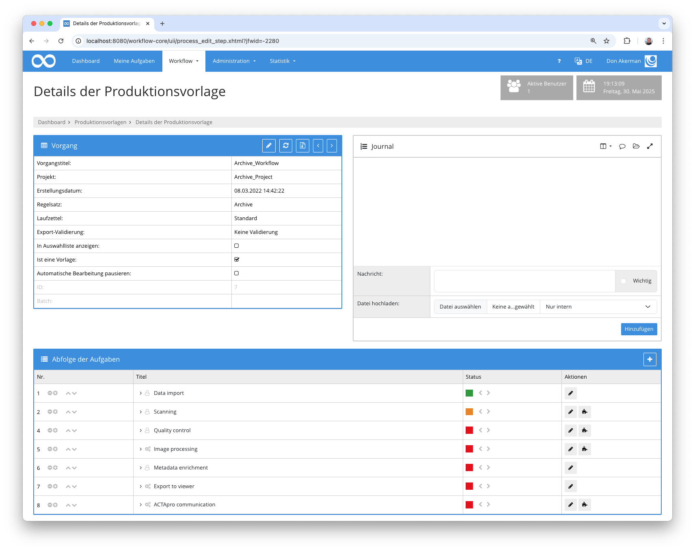
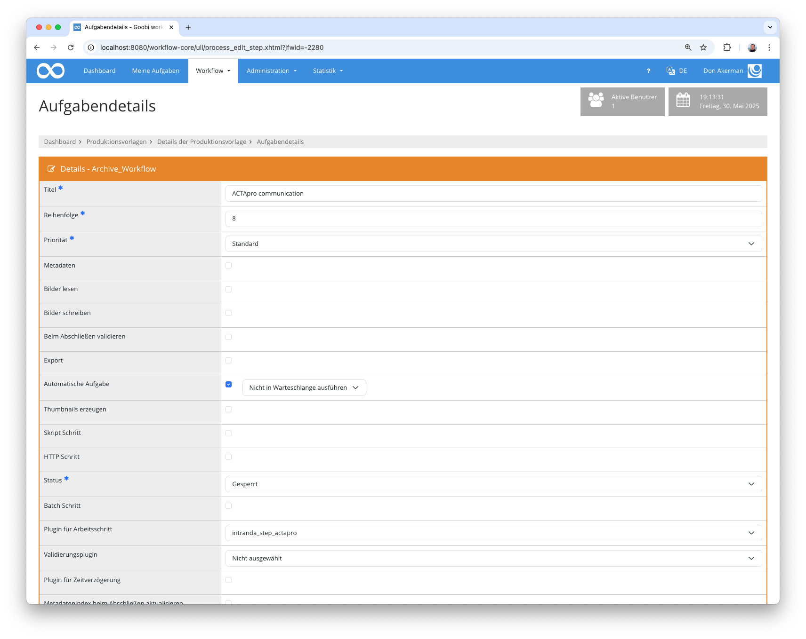

## Einführung

Dieses Plugin wird verwendet, um Informationen an ACTApro zu senden. Beliebige Daten können hierbei zu einem existierenden Knoten innerhalb von ACTApro hinzugefügt werden.


## Installation
Um das Plugin nutzen zu können, müssen folgende Dateien installiert werden:

```bash
/opt/digiverso/goobi/plugins/step/plugin-step-actapro-base.jar
/opt/digiverso/goobi/config/plugin_intranda_step_actapro.xml
```

Außerdem muss das `intranda_administration_actapro_sync` Administraion Plugin installiert und konfiguriert werden.

Nach der Installation des Plugins kann dieses innerhalb des Workflows für die jeweiligen Arbeitsschritte ausgewählt und somit automatisch ausgeführt werden. Ein Workflow könnte dabei beispielhaft wie folgt aussehen:



Für die Verwendung des Plugins muss dieses in einem Arbeitsschritt ausgewählt sein:




## Überblick und Funktionsweise

Wenn das Plugin ausgeführt wird, werden als erstes die Metadaten gelesen und das Feld gesucht, in dem die ID des ACTApro Datensatzes enthalten ist.

Anschließend werden die konfigurierten Pflichtfelder geprüft. Hier kann validiert werden, ob Metadaten oder Eigenschaften existieren. 

Wenn die Vorbedingungen erfüllt wurden, wird der ACTApro-Datensatz via REST API geholt und um die konfigurierten Daten angereichert.
Das so angereicherte Dokument wird als letztes wieder an die ACTApro API geschickt.

Fehlt die ACTApro ID, die konfigurierten Pflichtfelder oder wird der ACTApro-Datensatz nicht gefunden, schlägt das Plugin mit einer Fehlermeldung im Journal fehl.


## Konfiguration
Die Konfiguration des Plugins erfolgt in der Datei `plugin_intranda_step_actapro.xml` wie hier aufgezeigt:

{{CONFIG_CONTENT}}

{{CONFIG_DESCRIPTION_PROJECT_STEP}}

Parameter               | Erläuterung
------------------------|------------------------------------
`actaProIdFieldName`    | Enthält den Namen des Metadatums, in dem die ACTApro ID steht
`requiredField`         | Enthält eine Liste aller Pflichtfelder. Im Attribut `type` kann angegeben werden, ob es sich um eine Eigenschaft (`property`) oder um ein Metadatum (`metadata`) handelt. 
`field`                 | Enthält eine Felddefinition, die im ACTApro Dokument überschrieben oder hinzugefügt werden soll. Das Attribut `value` enthält den zu schreibenden Wert. Hierbei kann auf den VariableReplacer zugegriffen werden. In `type` steht der Feldname. Falls es sich um ein untergeordnetes Feld eines anderen Feldes handelt, kann das Hauptfeld in `groupType` angegeben werden. 
