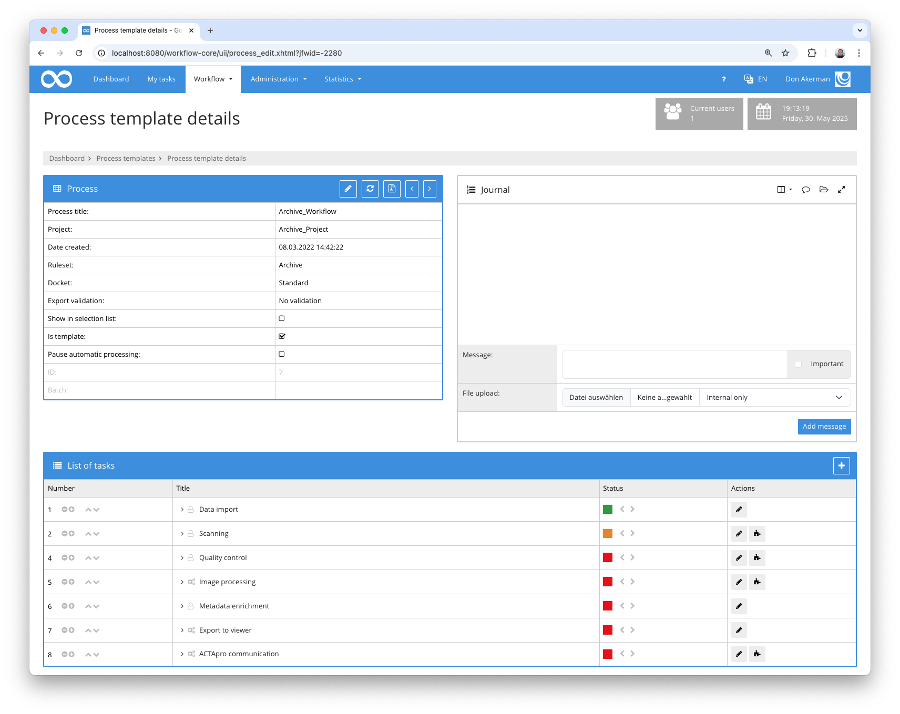
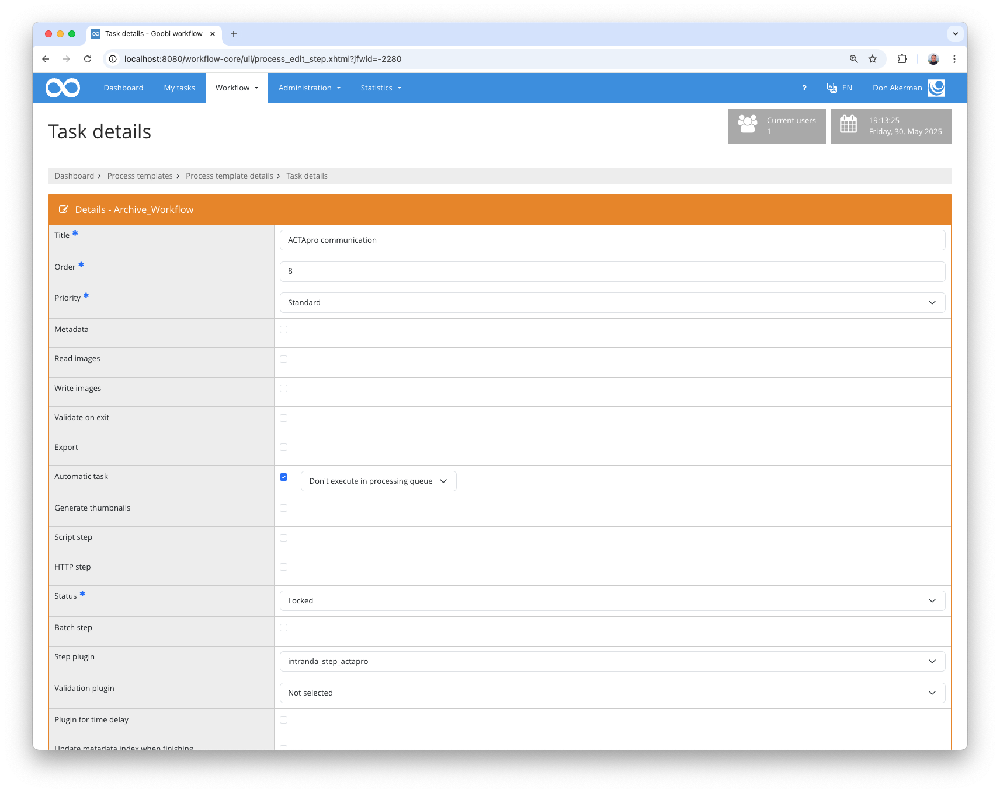

## Introduction

This plugin is used to send information to ACTApro. Any data can be added to an existing node within ACTApro.


## Installation
In order to use the plugin, the following files must be installed:

```bash
/opt/digiverso/goobi/plugins/step/plugin-step-actapro-base.jar
/opt/digiverso/goobi/config/plugin_intranda_step_actapro.xml
```

The `intranda_administration_actapro_sync` administration plugin must also be installed and configured.

Once the plugin has been installed, it can be selected within the workflow for the respective work steps and thus executed automatically. A workflow could look like the following example:



To use the plugin, it must be selected in a workflow step:




## Overview and functionality

When the plugin is executed, the metadata is read first and the field containing the ID of the ACTApro data record is searched for.

The configured mandatory fields are then checked. Here you can validate whether metadata or properties exist. 

If the preconditions have been met, the ACTApro data record is retrieved via REST API and enriched with the configured data.
The enriched document is sent back to the ACTApro API last.

If the ACTApro ID, the configured mandatory fields are missing or the ACTApro data record is not found, the plugin fails with an error message in the journal.


## Configuration
The plugin is configured in the file `plugin_intranda_step_actapro.xml` as shown here:

{{CONFIG_CONTENT}}

{{CONFIG_DESCRIPTION_PROJECT_STEP}}

Parameter               | Explanation
------------------------|------------------------------------
`actaProIdFieldName`    | Contains the name of the metadata containing the ACTApro ID
`requiredField`         | Contains a list of all mandatory fields. The `type` attribute can be used to specify whether it is a property (`property`) or a metadata (`metadata`). 
`field`                 | Contains a field definition that is to be overwritten or added in the ACTApro document. The `value` attribute contains the value to be written. The VariableReplacer can be accessed here. The field name is in `type`. If it is a subordinate field of another field, the main field can be specified in `groupType`. 
